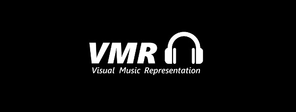
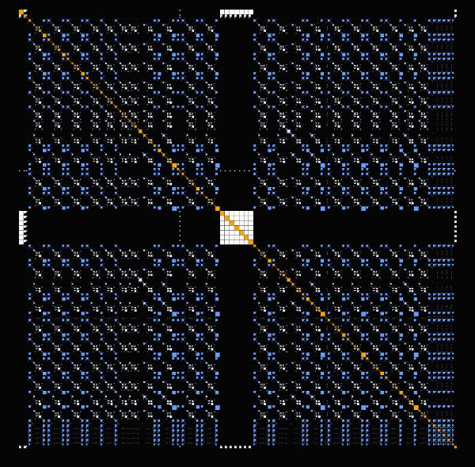

### _A Java/Processing integration of self-similarity matrices to visualize melodic repetitions_ 

## Features
VMR allows users to visualize the repetitions in the pitches and melodies of songs using self-similarity matrices (or recurence-plots).
It reads XML music files and creates self-similarity matrices using a series formed from the pitches in chronological order and then aligned it on the top-horizontal axis with respective pitch duration. The same is done on the left-vertical axis. This creates an array where squares of colour are drawn at the position in the matrix where the pitches on the horizontal and vertical axis are the same.

This is an example of how VMR (through processing) diplays a song.

_Visual representation of Do I Wanna Know, by Arctic Monkeys_

Here you can see that VMR displays different colors and patterns. 

_Note the following:_

(i)   The notes are placed on the two axis and form a diagonal from top-left to bottom-right of squares with sizes relative to the notes       duration. This diagonal is depicted in orange in the recurence-plot.

(ii)  For every pitch on both axis, a square is drawn on the array when it is repeated on the other axis. This forms a symmetry               reflected by the diagonal of the array.

(iii) For every additional squares, a shade of blue is assigned according to its pitch. The only exception being the pauses or silence         repetitions drawn as white squares.

## Installation

1) In order to run the VMR application, users will need to have the following program working in their computer:
   - [Processing](https://processing.org/)
   - [XMLwritter](https://xmlwriter.net/)
   - [Musescore](https://musescore.org/en)

2) Copy this repostitory into your computer.

3) Make sure to have G4P library properly implemented in the sketch directory. To do so, users must go into the libraries folder inside    the VMR directory. Then, continue their path into the G4P file, and then into library. They You must select the G4P.jar file and drag    it into the sketch. The code will then be all set.

_Note: A more indepth guide of VRM's installation and usages can be found in our [Medium Article](https://medium.com/@fil4444/d796aeed567)._ 

## Usages
1) Using [Musescore](https://musescore.org/en) or any other web souce, download the partition of the song you wish to visualize as a XML file. 

2) From the Musescore toolbar, select export (under the files tab) and name your file. Be sure to export it as a "XML uncompressed  (.musicXML)".

3) Go to your new uncompressed exported file. Select "Open with" and "Choose another app". There, you should select the XMLWriter application abovementioned.

4) Then, run the application and write the name of the XML file in the prompted box (including the extension). As soon as you run the app, you should see the visual representation of the chosen musical piece.

_Note: As mentioned above, a more indepth guide of VRM's installation and usages can be found in our [Medium Article](https://medium.com/@fil4444/d796aeed567)._ 

_Visual representation of Mobby Dick, by Led Zeppelin_

## Additional information
- Medium article : https://medium.com/@fil4444/d796aeed567
- DevPost page   : https://devpost.com/software/visual-music-representation 
- Youtube demo   : https://youtu.be/u8QVg0CY61k

## Testimonials
We would like to thank our discrete mathematics professor Dr. Patrick St.Amant for guiding us through this project. Moreover, this project was based off a project made by Colin Morris who wrote a similar program for the repetitions in the lyrics of pop songs. 
You can go check out his work at : https://colinmorris.github.io/SongSim/#/gallery

## Authors
Cédric Barré, Yael Demers, Félix-Antoine Johnson - 2018

| C. Barré | Y. Demers | F.A. Johnson  |
| :---:     | :-:         | :-:         |
| https://github.com/cedricBarre | https://github.com/yaeldemers | N/A |  
